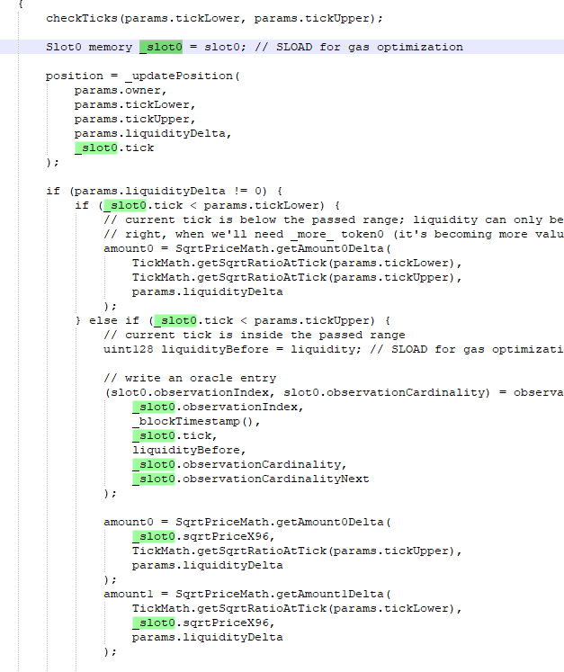

gas

这个函数里面 slot0 就是成员变量 如果不先加载到内存保存为_slot0 。你每次用slot0的数据要用一次sload .这里 6  7  次   花销就是 6*800 = 4800 gas

你如果开始加载一次 就放到evm内存里面了。后续没改变数据之前都用内存中的slot0. 不用每次都去数据库里面读。所有 就只要 一次 800就够了。。这样一个函数就节约了 4000gas 。 大致是这么意思

你可能solidity层面的优化就足够你节约到你需求以内了

兄弟。链上将一个0的数据变成非0数据。要消耗2W gas 。（ 24-18 ） /2 = 3 。 你多三个uint256的变量就 能多这么多。

一个变量 256bit 。 你用不到那么多数据。可以两个变量 整合成一个。一下又节约2w

少用 int  定义。用细致一点的变量定义。比如 int128 之类的。你发现又少了几万gas 。基本初步的优化就能达到你的效果了。